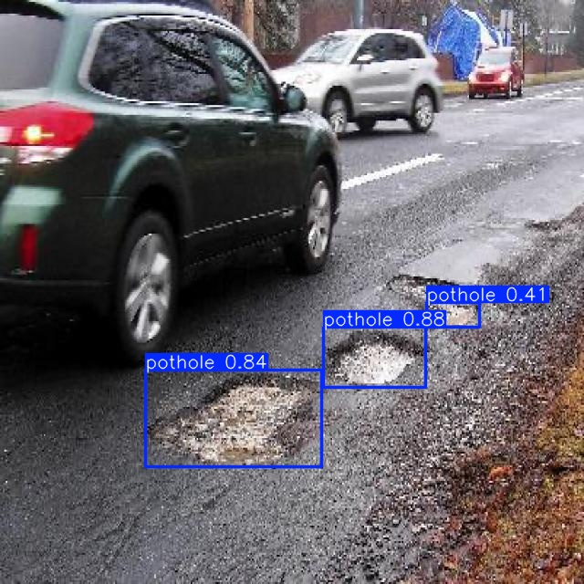
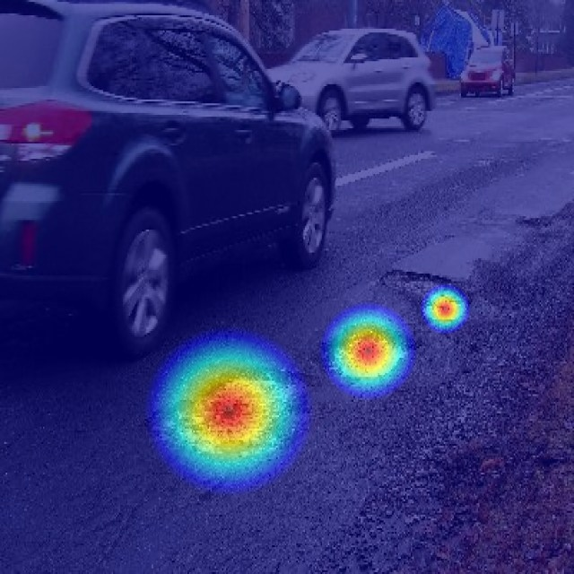
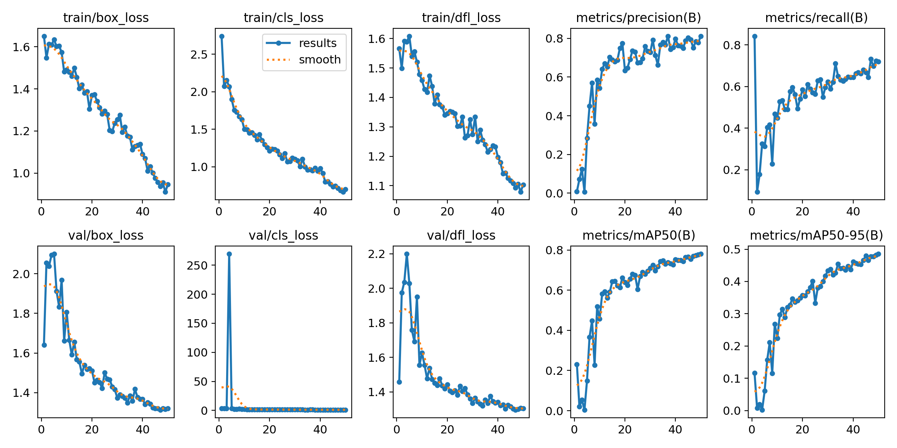
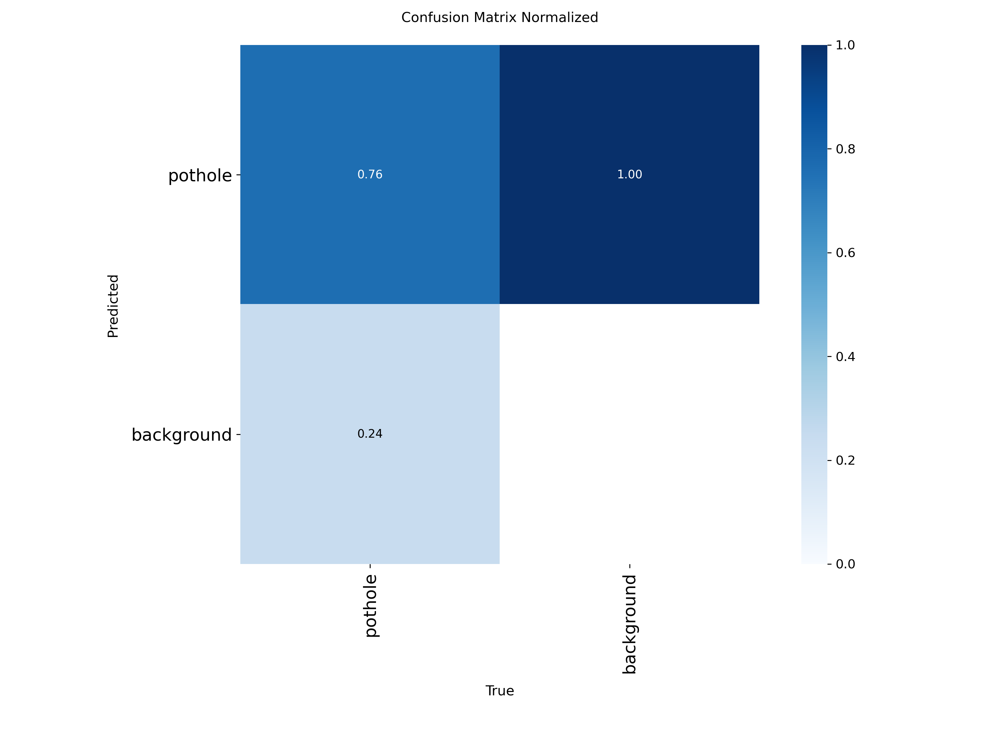
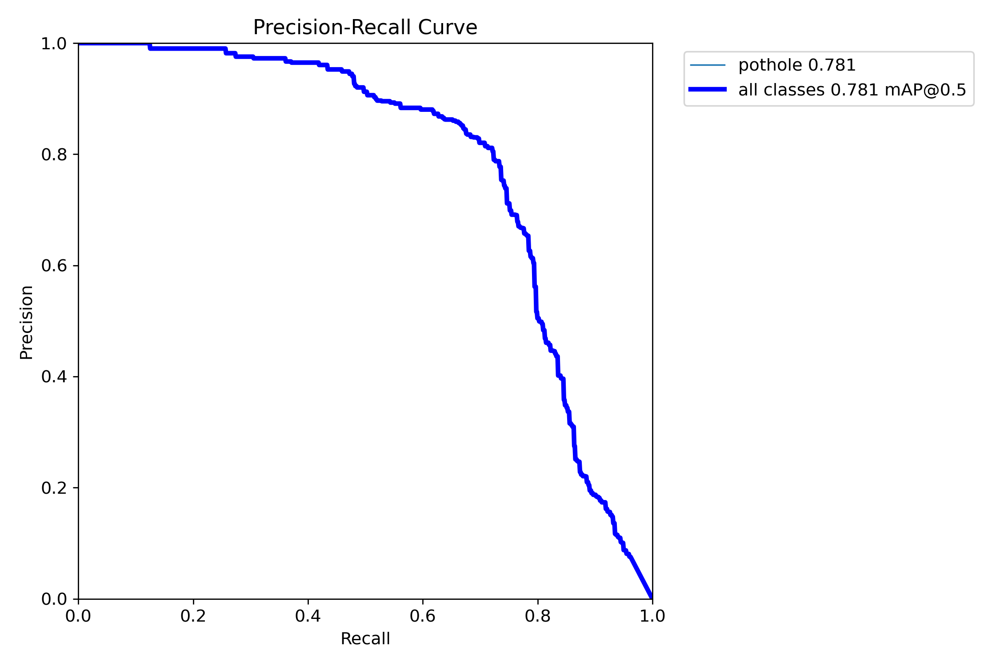
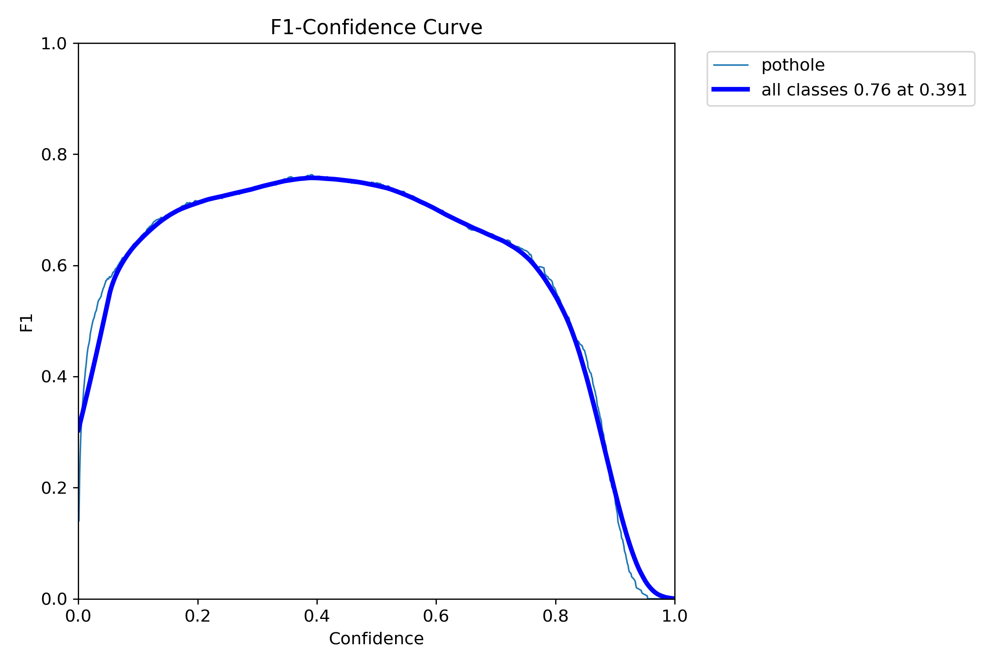
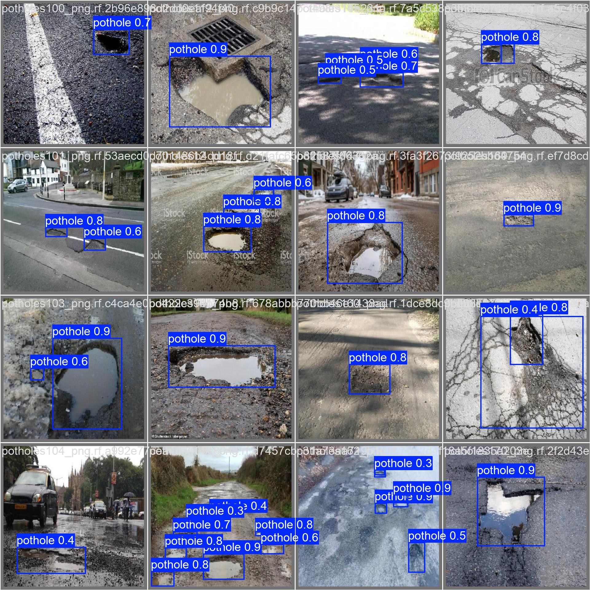

# 🕳️ AI Pothole Detection & Road Monitoring System

[](https://www.python.org/downloads/)
[](https://flask.palletsprojects.com/)
[](https://docs.ultralytics.com/)
[](https://pytorch.org/)
[](https://creativecommons.org/licenses/by/4.0/)

An end-to-end computer vision and web application system designed for automated road surface inspection. The application utilizes a custom-trained **YOLOv8 Nano** object detection model to localize potholes from road imagery and generates an intensity-based **severity heatmap overlay** using OpenCV to visualize road surface degradation.

---

## 📋 Table of Contents

1. [Overview](#-overview)
2. [Key Features](#-key-features)
3. [System Architecture & Workflow](#-system-architecture--workflow)
4. [Model & Performance](#-model--performance)
5. [Tech Stack](#-tech-stack)
6. [Dataset](#-dataset)
7. [Project Structure](#-project-structure)
8. [Installation](#-installation)
9. [Running the Application](#-running-the-application)
10. [API Reference](#-api-reference)
11. [Results & Visualizations](#-results--visualizations)
12. [Future Scope](#-future-scope)
13. [License & Acknowledgements](#-license--acknowledgements)

---

## 🔍 Overview

Potholes and road surface anomalies represent significant safety hazards and cause vehicle damage. Traditional road surveys require manual visual inspection, which is time-consuming and labor-intensive. 

This project delivers an automated pothole detection pipeline that:
- Ingests road surface photos through a modern web interface or a REST API endpoint.
- Runs inference via a fine-tuned **YOLOv8 Nano** deep learning model.
- Identifies pothole locations with bounding boxes and detection confidence scores.
- Computes an inverse-distance Gaussian-like density map to produce a **severity heatmap** overlay.
- Aggregates the total pothole count and the **Average Detection Confidence** across all detected regions.

---

## ✨ Key Features

- **Automated Pothole Localization**: Detects potholes in variable road conditions, lighting, and viewing angles with tight bounding boxes.
- **Dual Visual Output**: Generates both standard annotated bounding-box imagery and an OpenCV `COLORMAP_JET` radial heatmap overlay for spatial severity analysis.
- **Metric Aggregation**: Automatically calculates total potholes detected and the **Average Detection Confidence** score across detected instances.
- **Lightweight REST API**: Built on Flask with CORS support, multipart file upload handling, and static image serving.
- **Modern Responsive Web UI**: Clean dashboard built with semantic HTML5, modern CSS custom properties, Poppins typography, and responsive image preview panels.
- **Client-Side Auth Simulation**: Sign In / Sign Up user interface with client-side credential persistence via `localStorage` and `sessionStorage`.
- **Standalone ML Scripts**: Dedicated, modular Python scripts for model training (`Train.py`), validation evaluation (`Valid.py`), and batch directory inference (`Test.py`).

---

## 🏗️ System Architecture & Workflow

```
[ User Browser (Port 5500) ]
        │
        ├─► Selects / Drops Road Image
        └─► Submits "Detect Potholes"
                │
                ▼ (POST multipart/form-data)
[ Flask REST API Server (Port 5000) ] ─── /predict
        │
        ├─► 1. Saves image to `backend/uploads/` via secure_filename
        ├─► 2. Runs YOLOv8n Inference (imgsz=640, conf=0.20)
        ├─► 3. Extracts Bounding Boxes (xyxy) & Confidences
        ├─► 4. Calculates Metrics: Pothole Count & Avg Detection Confidence
        ├─► 5. Renders Annotated Detection Image -> `backend/outputs/detected_*`
        ├─► 6. Generates Radial Intensity Heatmap -> `backend/outputs/heatmap_*`
        │
        ▼ (JSON Response with Image & Heatmap URLs)
[ Dashboard UI ]
        │
        ├─► Displays Pothole Count & Average Confidence
        ├─► Renders Side-by-Side Original vs. Detected Image
        └─► Renders Heatmap Overlay & Scrolls to Heatmap Section
```

---

## 📊 Model & Performance

The model was trained by fine-tuning `yolov8n.pt` (YOLOv8 Nano) on a single class (`pothole`) over 50 epochs at a resolution of 640×640 pixels.

### Training Hyperparameters
* **Base Architecture**: YOLOv8 Nano (`yolov8n.pt`)
* **Task**: Object Detection (`detect`)
* **Input Resolution**: 640 × 640 pixels
* **Epochs**: 50
* **Batch Size**: 16
* **Inference Confidence Threshold**: `conf = 0.20`
* **Optimizer**: SGD (`lr0 = 0.01`, `momentum = 0.937`, `weight_decay = 0.0005`)

### Validation Metrics (Epoch 50)

| Metric | Score | Description |
| :--- | :--- | :--- |
| **Precision (B)** | **81.14%** (`0.8114`) | Accuracy of positive pothole predictions |
| **Recall (B)** | **72.05%** (`0.7205`) | Fraction of actual potholes successfully detected |
| **mAP@50 (B)** | **78.06%** (`0.7806`) | Mean Average Precision at IoU threshold = 0.50 |
| **mAP@50-95 (B)** | **48.56%** (`0.4856`) | Mean Average Precision across IoU thresholds 0.50 to 0.95 |
| **Box Loss (Val)** | `1.3198` | Bounding box regression loss |
| **Class Loss (Val)** | `1.1108` | Classification loss |
| **DFL Loss (Val)** | `1.3039` | Distribution focal loss |

> **⚠️ Metric Clarification**: In the application dashboard, the displayed percentage represents the **Average Detection Confidence** of bounding boxes found in that specific image (`float(confidences.mean()) * 100`), rather than an overall classification accuracy metric.

---

## 💻 Tech Stack

### Machine Learning & Computer Vision
* **Ultralytics YOLOv8**: Object detection framework and model checkpoints.
* **PyTorch & Torchvision**: Deep learning runtime and tensor operations.
* **OpenCV (`opencv-python`)**: Image processing, radial distance calculations, color mapping (`cv2.COLORMAP_JET`), and alpha blending (`cv2.addWeighted`).
* **NumPy**: Numerical matrix manipulation and intensity normalization.

### Backend
* **Python 3.8+**: Core backend runtime.
* **Flask**: Lightweight WSGI web framework and routing engine.
* **Flask-CORS**: Cross-Origin Resource Sharing handler for decoupled frontend-backend communication.
* **Werkzeug**: Secure filename sanitization.

### Frontend
* **HTML5**: Semantic web markup.
* **Vanilla CSS3**: Design system featuring CSS variables, animated gradients, glassmorphic cards, and responsive flex/grid layouts.
* **Vanilla JavaScript (ES6+)**: Fetch API, async/await HTTP requests, DOM manipulation, `localStorage` and `sessionStorage` session tracking.
* **Font Awesome 6.5.2 & Google Fonts (Poppins)**: Iconography and typography.

---

## 📁 Dataset

The dataset was sourced via [Roboflow Universe](https://universe.roboflow.com/reni-joby/pothole-detection-bfeeg) and contains annotations specifically tailored for road pothole localization in YOLOv8 format.

* **Total Images**: **665 images**
  * **Train Set**: 465 images (70%)
  * **Validation Set**: 133 images (20%)
  * **Test Set**: 67 images (10%)
* **Classes**: `1` (`pothole`)
* **Preprocessing**: Auto-orientation with EXIF stripping; resized to 640×640 (stretch).

---

## 📂 Project Structure

```
Pothole_Detection_System_B41/
├── start.ps1                                # PowerShell launch script (Backend + Frontend)
├── .gitignore                               # Git ignore rules for runtime/generated files
├── README.md                                # Project documentation
├── backend/
│   ├── app.py                               # Flask REST API with YOLOv8 & OpenCV Heatmap
│   ├── Train.py                             # Script to train YOLOv8 on pothole_dataset
│   ├── Valid.py                             # Script to validate trained model on val split
│   ├── Test.py                              # Script to run test batch predictions
│   ├── requirements.txt                     # Backend Python dependencies
│   ├── yolov8n.pt                           # Pretrained base YOLOv8 Nano weights
│   ├── uploads/                             # Upload directory for user input images
│   ├── outputs/                             # Storage for generated detections & heatmaps
│   └── pothole_dataset/                     # Roboflow dataset
│       ├── data.yaml                        # Dataset split paths and class mapping
│       ├── README.dataset.txt               # Dataset metadata
│       ├── README.roboflow.txt              # Roboflow export and preprocessing details
│       ├── train/                           # 465 training images & YOLO format labels
│       ├── valid/                           # 133 validation images & YOLO format labels
│       └── test/                            # 67 test images & YOLO format labels
├── frontend/
│   ├── index.html                           # Authentication view (Sign In / Sign Up)
│   ├── dashboard.html                       # Detection dashboard with image upload & metrics
│   ├── script.js                            # Frontend API handler and UI state logic
│   ├── style.css                            # Main theme, layout, and component styling
│   ├── auth.css                             # Dedicated authentication screen styling
│   └── logo.jpg                             # Application logo badge
└── runs/
    └── detect/
        ├── predict/                         # Output results from batch test predictions
        └── runs/detect/train/               # Training run logs, weights, and evaluation plots
            ├── weights/
            │   ├── best.pt                  # Best fine-tuned model checkpoint (used in app)
            │   └── last.pt                  # Last training epoch checkpoint
            ├── results.csv                  # Epoch-by-epoch training logs (50 epochs)
            ├── results.png                  # Loss and mAP curve progression charts
            ├── confusion_matrix_normalized.png # Normalized confusion matrix
            ├── BoxPR_curve.png              # Precision-Recall curve
            ├── BoxF1_curve.png              # F1-Confidence curve
            └── args.yaml                    # Training arguments and hyperparameters
```

---

## ⚙️ Installation

### 1. Prerequisites
* Python `3.8` to `3.11` installed
* `git` installed

### 2. Clone the Repository
```bash
git clone https://github.com/Simhadrinakka/Pothole-Detection-System.git
cd Pothole-Detection-System
```

### 3. Set Up Virtual Environment
* **Windows (PowerShell)**:
  ```powershell
  python -m venv .venv
  .\.venv\Scripts\Activate.ps1
  ```
* **Linux / macOS**:
  ```bash
  python3 -m venv .venv
  source .venv/bin/activate
  ```

### 4. Install Dependencies
```bash
pip install -r backend/requirements.txt
```

---

## 🚀 Running the Application

### Option A: One-Click Startup (Windows PowerShell)
Use the included PowerShell script to launch both the Flask backend (port 5000) and the frontend HTTP server (port 5500) simultaneously:
```powershell
.\start.ps1
```

### Option B: Manual Startup (Two Terminals)

* **Terminal 1 — Backend API**:
  ```bash
  python backend/app.py
  ```
  *Server starts at `http://127.0.0.1:5000`*

* **Terminal 2 — Frontend**:
  ```bash
  cd frontend
  python -m http.server 5500
  ```
  *Access the web UI at `http://127.0.0.1:5500` in your web browser.*

---

## 🔌 API Reference

### 1. Health Check
* **Endpoint**: `GET /`
* **Description**: Returns server status.
* **Response**:
  ```json
  {
    "status": "ok",
    "message": "Backend is running!"
  }
  ```

### 2. Run Pothole Prediction & Heatmap Generation
* **Endpoint**: `POST /predict`
* **Description**: Accepts an uploaded road image, runs YOLOv8 detection, creates a heatmap overlay, and returns output URLs and stats.
* **Content-Type**: `multipart/form-data`
* **Form Field**: `image` (File binary: `.jpg`, `.jpeg`, `.png`)
* **Response (`200 OK`)**:
  ```json
  {
    "count": 3,
    "accuracy": 71.0,
    "image_url": "http://127.0.0.1:5000/output/detected_potholes187_png.rf.ee7b134ab554dc00b0d29b3595614c18.jpg",
    "heatmap_url": "http://127.0.0.1:5000/output/heatmap_potholes187_png.rf.ee7b134ab554dc00b0d29b3595614c18.jpg"
  }
  ```

> **Response Field Definitions**:
> * `count` (*integer*): Total number of pothole bounding boxes detected in the image.
> * `accuracy` (*float*): **Average Detection Confidence** percentage across the detected potholes (computed as `mean(confidences) * 100`). *Note: While the API field is named `"accuracy"`, it represents mean detection confidence for detected instances, not overall classification accuracy.*
> * `image_url` (*string*): URL to access the bounding-box annotated output image.
> * `heatmap_url` (*string*): URL to access the OpenCV Jet heatmap overlay output image.

### 3. Fetch Generated Image Outputs
* **Endpoint**: `GET /output/<filename>`
* **Description**: Serves processed detection or heatmap image files directly from `backend/outputs/`.

---

## 🖼️ Results & Visualizations

### 1. Pothole Detection Output (Bounding Boxes)
Annotated detection result from YOLOv8n showing localized potholes with individual confidence scores:



---

### 2. Severity Heatmap Visualization
Blended OpenCV Jet colormap heatmap overlay highlighting damage concentration and pothole crater centers:



---

### 3. Model Training Loss & Metrics Progression
Training and validation loss progression (`box_loss`, `cls_loss`, `dfl_loss`) and evaluation metrics over 50 epochs:



---

### 4. Normalized Confusion Matrix
Normalized confusion matrix evaluating true-positive pothole detection rate against background:



---

### 5. Precision-Recall Curve
Precision vs. Recall curve demonstrating `0.781 mAP@0.5` across all classes:



---

### 6. F1-Confidence Curve
F1-Confidence curve reaching a peak score of `0.76` at a `0.391` confidence threshold:



---

### 7. Batch Validation Predictions Mosaic
Sample batch validation predictions illustrating robust multi-scenario detection performance:



---

## 🔭 Future Scope

- [ ] **Video Stream Inference**: Extend the inference pipeline to support video files (`.mp4`, `.avi`) and sequential frame analysis.
- [ ] **GPS & GIS Mapping**: Extract EXIF GPS coordinates from mobile uploads and plot detected road hazards on an interactive map (e.g., Leaflet or Mapbox).
- [ ] **Multi-Defect Classification**: Expand the dataset to detect additional road distress categories such as longitudinal cracks, alligator cracking, and rutting.
- [ ] **Backend Database Integration**: Connect a persistent database (PostgreSQL / SQLite) for historical road audit logging and automated maintenance work orders.
- [ ] **Edge Deployment**: Export model to ONNX, TensorRT, or CoreML formats for low-power on-vehicle embedded hardware (e.g., Raspberry Pi, Jetson Nano).

---

## 📜 License & Acknowledgements

* **Dataset License**: [Creative Commons Attribution 4.0 International (CC BY 4.0)](https://creativecommons.org/licenses/by/4.0/), exported via [Roboflow](https://universe.roboflow.com/reni-joby/pothole-detection-bfeeg).
* **Model Framework**: [Ultralytics YOLOv8](https://github.com/ultralytics/ultralytics).
* **Libraries**: Powered by PyTorch, OpenCV, Flask, and NumPy.
